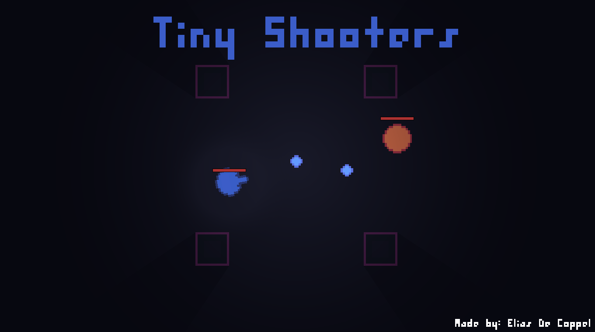
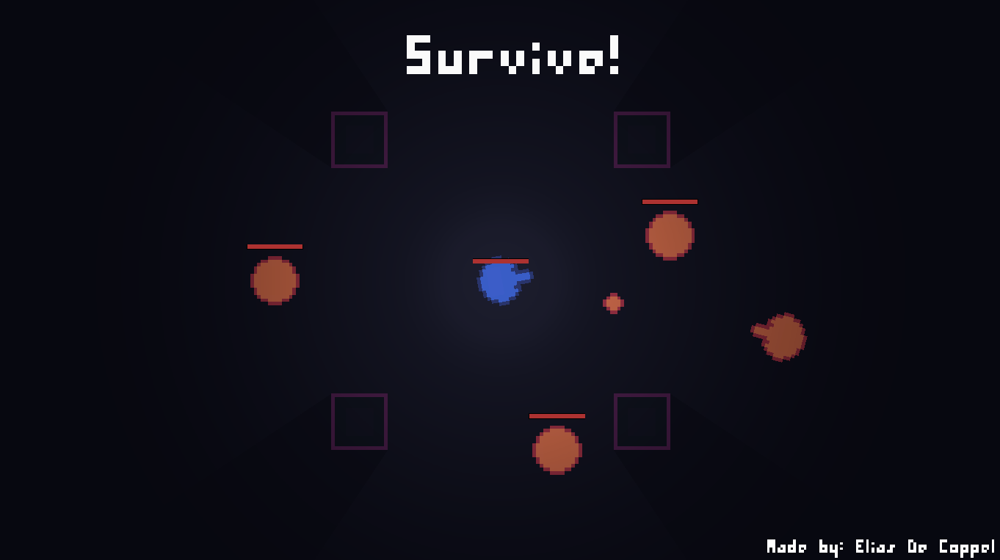
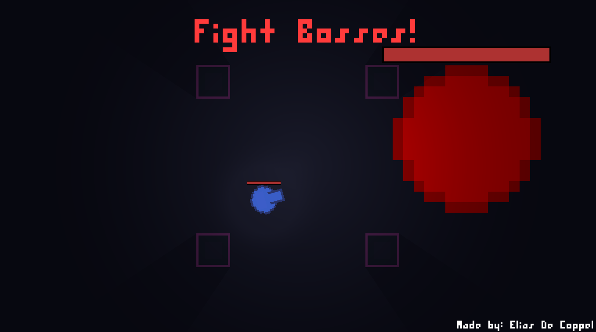
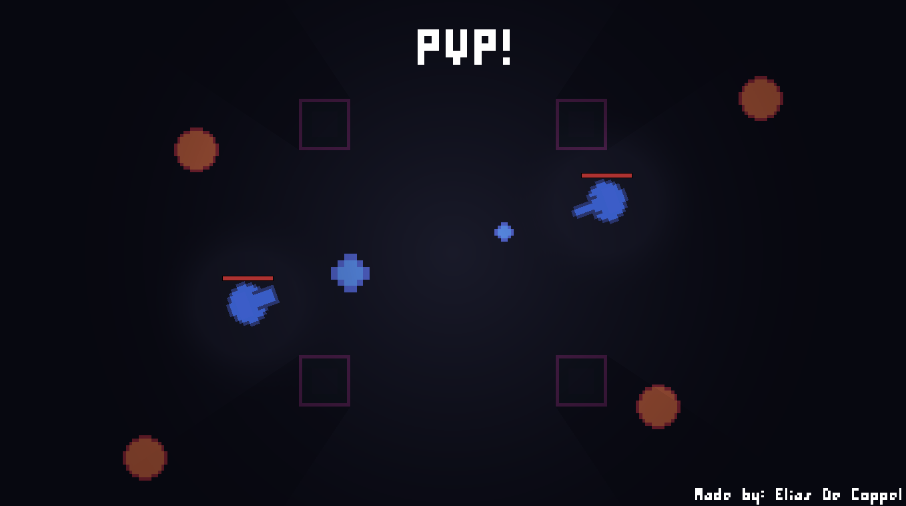

# Tiny Shooters

**Tiny Shooters** is a top-down survival shooter where you must:

- Survive multiple waves of enemies.  
- Fight challenging bosses.  
- Become stronger by upgrading your character!

[Click Here](https://decoppelelias.itch.io/tiny-shooters) to to play the game on Itch.io!

### Features:
- **Multiple Player Classes**: Choose from a total of 9 player classes, each providing a unique playstyle!
- **Challenging Campaign**: Complete the 3 carefully crafted levels and fight the final boss!
- **Local PvP Mode**: Challenge your friends in intense battles! *(Gamepad required for multiplayer)*  
- **Online Leaderboard**: Compete for the best score and showcase your skills to the world!

### What I learned
This game is the most refined game I made untill now (2024). In the future, I see myself adding more features to this project. To make this possible, I have put a lot of effort in making sure the code is readable and expandable.

Here are the main things I'm proud of:
- **Level Creation and Wave Management**: I have created a system that reads a .txt file and converts the text into different levels and waves. This makes it really easy to add more levels and waves later on.
- **Enemy Creation**: Enemy creation is also made simple. By using polymorphism, a new enemy can inheret from base enemy behaviour and then customise it in unique ways. I have also used a modular ability approach. The game contains multiple *Abilities*, Examples are *ShootingAbility, DashingAbility, ReflectingAbility*. Enemy AI can use these abilities to further customise their behaviour.
- **Player Classes**: The game contains multiple unique player classes. Adding a new class can be simply done by creating a new class ScriptableObject template. This template contains multiple options about player health, damage, ability cooldowns, etc. Making it easy to create a new unique class.
- **Online Leaderboard**: The online leaderboard was implemented by integrating the [Leaderboard Creator Tool by Danial Jumagaliyev](https://danqzq.itch.io/leaderboard-creator). This has the advantage that I do not have to manage a leaderboard server by myself. The disadvantage is that I am dependent on Danial to keep the leaderboard active.

### Media
#### Video Compilation

[Click Here](https://www.youtube.com/watch?v=Tr44kK1eFEw) to view the full video!

#### Screenshots

